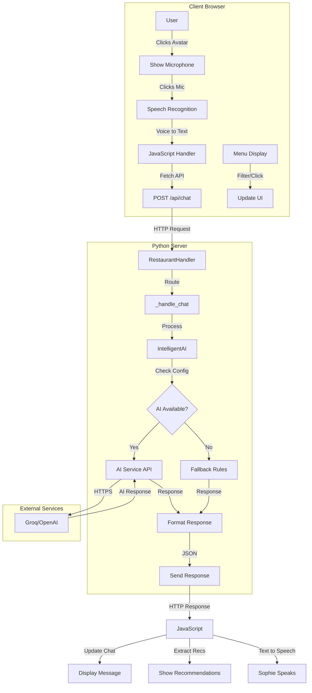

# 🔄 Restaurant AI - Flow Diagrams

## 1. Complete System Flow



## 2. Voice Interaction Flow

```
┌─────────────┐     ┌─────────────┐     ┌─────────────┐
│   User      │     │   Browser   │     │   Server    │
└─────────────┘     └─────────────┘     └─────────────┘
      │                    │                    │
      │ Click Sophie 👩‍💼   │                    │
      │------------------->│                    │
      │                    │                    │
      │ See Microphone 🎤  │                    │
      │<-------------------|                    │
      │                    │                    │
      │ Click & Speak      │                    │
      │------------------->│                    │
      │                    │ Start Recording    │
      │                    │ (Web Speech API)   │
      │                    │                    │
      │ "I'm hungry"       │                    │
      │------------------->│                    │
      │                    │ Convert to Text    │
      │                    │                    │
      │                    │ Send Message       │
      │                    |------------------->│
      │                    │                    │ Process with AI
      │                    │                    │ 
      │                    │ Response + Recs    │
      │                    │<-------------------|
      │                    │                    │
      │ Show Message       │                    │
      │<-------------------|                    │
      │                    │                    │
      │ Hear Sophie        │                    │
      │<-------------------| (Text to Speech)  │
      │                    │                    │
```

## 3. AI Processing Pipeline

```
User Message: "Something spicy"
         │
         ▼
┌─────────────────────┐
│ Conversation History│
│ + System Prompt     │
│ + User Message      │
└─────────────────────┘
         │
         ▼
┌─────────────────────┐
│   AI API Request    │
│ • Model: llama3-70b │
│ • Max tokens: 80    │
│ • Temperature: 0.8  │
└─────────────────────┘
         │
         ▼
┌─────────────────────┐
│   AI Response       │
│ "Yes! 🔥 Thai curry │
│ brings the heat -   │
│ you'll love it!"    │
└─────────────────────┘
         │
         ▼
┌─────────────────────┐
│ Extract Menu Items  │
│ • Thai Red Curry    │
│ • Match by name     │
│ • Return full data  │
└─────────────────────┘
         │
         ▼
┌─────────────────────┐
│   Final Response    │
│ • Message (text)    │
│ • Recommendations   │
│ • Timestamp         │
└─────────────────────┘
```

## 4. Menu Filtering Flow

```
User Action: Click "Vegetarian" checkbox
                    │
                    ▼
         ┌──────────────────┐
         │ Update AppState  │
         │ vegetarian: true │
         └──────────────────┘
                    │
                    ▼
         ┌──────────────────┐
         │ filterMenuItems()│
         └──────────────────┘
                    │
                    ▼
    ┌───────────────┴───────────────┐
    │        Apply Filters          │
    │ • Category: current           │
    │ • Vegetarian: ✓               │
    │ • Vegan: ✗                    │
    │ • Gluten-free: ✗              │
    └───────────────────────────────┘
                    │
                    ▼
         ┌──────────────────┐
         │ Filter Results    │
         │ • Quinoa Bowl     │
         │ • Caesar Salad    │
         │ • Bruschetta      │
         └──────────────────┘
                    │
                    ▼
         ┌──────────────────┐
         │ renderMenuItems() │
         │ Update DOM        │
         └──────────────────┘
```

## 5. Error Handling Flow

```
                  API Call Fails
                       │
                       ▼
            ┌──────────────────┐
            │ HTTP Error / Timeout │
            └──────────────────┘
                       │
                       ▼
            ┌──────────────────┐
            │ Log Error Details │
            │ • Error code      │
            │ • Stack trace     │
            │ • User message    │
            └──────────────────┘
                       │
                       ▼
            ┌──────────────────┐
            │ Fallback Decision │
            └──────────────────┘
                       │
         ┌─────────────┴─────────────┐
         ▼                           ▼
┌──────────────────┐       ┌──────────────────┐
│ Rule-based       │       │ Error Message    │
│ Response         │       │ to User          │
└──────────────────┘       └──────────────────┘
         │                           │
         └─────────────┬─────────────┘
                       ▼
            ┌──────────────────┐
            │ Send Response     │
            │ Continue Flow     │
            └──────────────────┘
```

## 6. Speech Synthesis Flow

```
AI Response Text: "Yes! 🔥 Thai curry brings the heat!"
                            │
                            ▼
                 ┌──────────────────────┐
                 │ Clean Text for Speech│
                 │ • Remove emojis      │
                 │ • 🔥 → ""            │
                 │ • 😋 → "mmm"         │
                 └──────────────────────┘
                            │
                            ▼
                 ┌──────────────────────┐
                 │ Create Utterance      │
                 │ • Rate: 0.95         │
                 │ • Pitch: 1.2         │
                 │ • Volume: 0.9        │
                 └──────────────────────┘
                            │
                            ▼
                 ┌──────────────────────┐
                 │ Select Voice          │
                 │ Priority:             │
                 │ 1. Samantha (iOS)     │
                 │ 2. Zira (Windows)     │
                 │ 3. Female voices      │
                 └──────────────────────┘
                            │
                            ▼
                 ┌──────────────────────┐
                 │ speechSynthesis.speak │
                 └──────────────────────┘
                            │
                            ▼
                 ┌──────────────────────┐
                 │ Audio Output          │
                 │ "Yes! Thai curry      │
                 │  brings the heat!"    │
                 └──────────────────────┘
```

## 7. Logging Flow

```
Request Received
      │
      ▼
┌─────────────────┐
│ Log Request Info│
│ • Method        │
│ • Path          │
│ • Client IP     │
└─────────────────┘
      │
      ▼
┌─────────────────┐
│ Process Request │
│ • Log steps     │
│ • Time tracking │
└─────────────────┘
      │
      ├──── Success Path ────┐
      │                      │
      ▼                      ▼
┌─────────────────┐    ┌─────────────────┐
│ Log Success     │    │ Log Error       │
│ • Response time │    │ • Exception     │
│ • Status code   │    │ • Stack trace   │
│ • Data size     │    │ • Context       │
└─────────────────┘    └─────────────────┘
      │                      │
      └──────────┬───────────┘
                 ▼
         ┌─────────────────┐
         │ Write to:       │
         │ • Console       │
         │ • restaurant_ai.log │
         └─────────────────┘
```

These diagrams illustrate the complete flow of data and control through the Restaurant AI application, from user interaction to AI processing and response delivery.